# iCorrespondencia

Benefícios do DevOps e sua esteira automatizada + Parametrização de deploy automatizado com Jenkins e Microsoft Azure.

## Tabela de conteúdo

-   [Benefícios](#benefícios)
-   [Requisitos](#requisitos)
-   [Configuração necessária](#configuração-necessária)
    -   [Apache Maven](#apache-maven)
        -   [Azure](#azure)
        -   [Maven](#maven)
    -   [PostgreSQL](#postgresql)
        -   [Grupo de recursos](#grupo-de-recursos)
        -   [Instância de Banco de Dados](#instância-de-banco-de-dados)
        -   [Banco de Dados da Aplicação](#banco-de-dados-da-aplicação)
    -   [Jenkins](#jenkins)
        -   [Ferramentas Globais](#ferramentas-globais)
    -   [Extra](#extra)

## Benefícios

Toda a cultura DevOps já entrega uma melhoria enorme no ciclo completo de desenvolvimento de softwares até a entrega do artefato em si. Juntamente a metodologia ágil aplicada, podem tornar o software mais conciso e como menos "bugs" durante o release.

Entre essas melhorias se encontram:

-   **CI (Continuous Integration ou Integração Contínua)/CD (Continuous Delivery ou Entrega Contínua):** como o próprio nome aponta, esse "step" trabalha a integração e entrega contínua de um software. Sendo assim, é possível executar atualizações pequenas, mas com muita frequência. Com isso, é possível as empresas inovarem mais em um período menor e os seus clientes sentirem essas inovações.

-   **Confiabilidade:** por automatizar parte da infraestrutura e desenvolvimento, é possível garantir a qualidade das entregas futuras.

-   Dentre outros pontos encontra-se **Segurança**, **Escalabilidade**, **Melhoria na colaboração entre equipes**, etc...

E essas aplicações podem ser visualizadas, como exemplo, aqui neste repositório, auxiliando nas entregas automatizadas da API para a **Challenge 2021** em parceria com a **Plusoft**.

## Requisitos

-   Apache Maven 3.x
-   Azure CLI 2.x
-   Jenkins 2.x
-   PostgreSQL 9.x
-   Azure Data Studio 1.x ou o próprio cli do postgres (caso tenha instalado em sua máquina)

## Configuração Necessária

Para realizar a configuração do deploy automatizado no Jenkins, antes é necessário fazer algumas configurações **na máquina onde o Jenkins está instalado**.

### Apache Maven

#### Azure

É necessário criar um **Azure Active Directory de Serviço** ou **Azure Service Principal** para o **Maven** conseguir realizar a **autenticação**.

Para isso, execute o seguinte comando no terminal:

```sh
az login
```

Uma aba será aberta no seu navegador pedindo pra escolher a conta que será utilizada. Após selecionado, será exibido a seguinte mensagem:

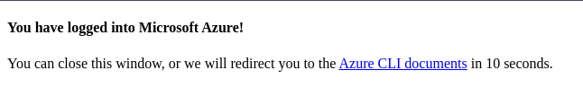

E no terminal:

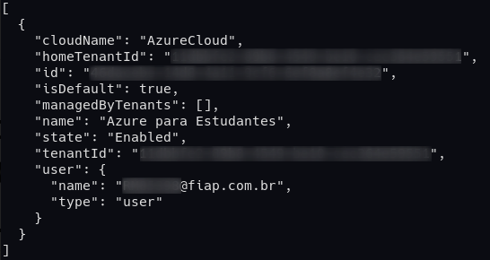

Em seguida, vamos criar a autenticação com o seguinte comando:

```sh
az ad sp create-for-rbac -n icorrespondencia
```

E o output trará as credenciais que necessitamos pra configurar no Maven:

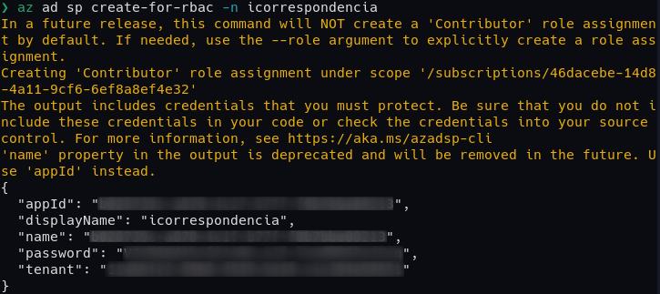

#### Maven

Acesse o arquivo de configurações e entre com as credenciais recebidas no comando anterior: `/<path-to-maven>/conf/settings.xml`

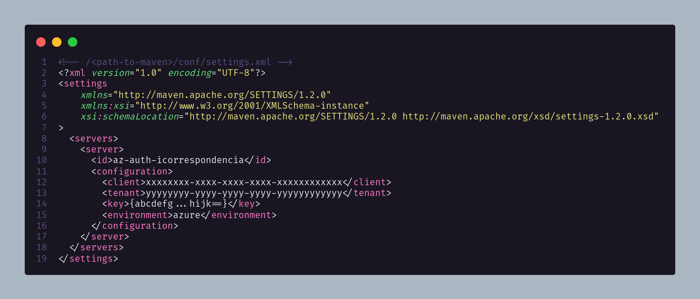

:warning: Atente-se as configurações onde:

-   **id:** deve ser exatamente **az-auth-icorrespondencia** (equivalente a serverId no **pom.xml** do projeto)
-   **client:** deve conter o valor da chave **appId**
-   **tenant:** deve conter o valor da chave **tenant**
-   **key:** deve conter o valor da chave **password**
-   **environment:** deve ser exatamente **azure** (aponta para qual ambiente azure cloud deve ser utilizado)

:bulb: Mais detalhes sobre a configuração do Maven web app podem ser encontradas em [Github: Azure maven wepapp plugin](https://github.com/microsoft/azure-maven-plugins/wiki/Authentication#service-principles-in-plugin-configuration).

### PostgreSQL

Primeiro vamos criar o **Grupo de recursos** que vai englobar tanto o banco de dados quanto posteriormente a aplicação.

#### Grupo de Recursos

Utilize o seguinte comando para criar o grupo:

```sh
az group create --name rg-21things-challenge --location brazilsouth
```

Será retornado um JSON confirmando que o grupo de recursos foi criado.

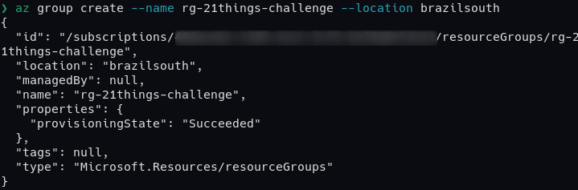

#### Instância de Banco de Dados

Utilize o comando a seguir para criar uma instância do banco de dados:

```sh
az postgres server create --resource-group rg-21things-challenge \
    --name icorrespondencia-server \
    --location brazilsouth \
    --admin-user postgres \
    --admin-password Dev0ps@2021 \
    --sku-name B_Gen5_1
```

É esperado um JSON como retorno indicando êxito:

:warning: Atente-se as marcações realizadas, pois serão utilizadas posteriormente.

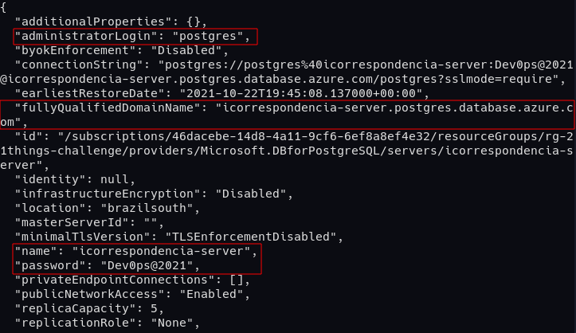

Em seguida, vamos criar uma regra no Firewall para liberar o acesso a todos os IP's:

:warning: Lembrando que o indicado é liberar apenas o acesso para o IP da máquina de um DBA e para o IP da aplicação. Isso pode ser feito alterando o **start-ip** e o **end-ip**.

```sh
az postgres server firewall-rule create --resource-group rg-21things-challenge \
    --server icorrespondencia-server \
    --name AllowAll \
    --start-ip-address 0.0.0.0 \
    --end-ip-address 255.255.255.255
```

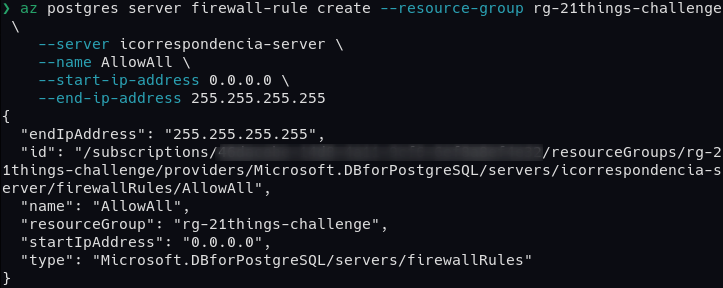

:bulb: Mais detalhes sobre podem ser conferidos em [Microsoft Docs: Criar servidor de banco de dados pela Azure CLI](https://docs.microsoft.com/pt-br/azure/postgresql/quickstart-create-server-database-azure-cli).

#### Banco de dados da aplicação

Por padrão, a nova instância gerada trará um banco de dados chamado `postgres`. Como boa prática, vamos criar um para nossa aplicação.

:bulb: Vamos utilizar o editor **Azure Data Studio** para realizar esse procedimento por uma interface mas, sinta-se a vontade para fazer pelo shell ou qualquer outro editor a sua escolha.

Abra o editor e certifique-se de ter a extensão do PostgreSQL instalada e habilitada:

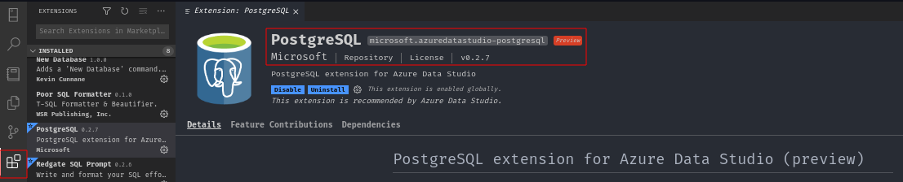

Em seguida, vamos criar uma nova conexão:

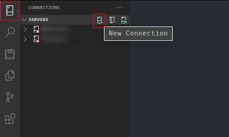

Na parametrização, é esperada a seguinte parametrização:

-   **Connection Type:** PostgreSQL
-   **Server Name:** icorrespondencia-server.postgres.database.azure.com (caso tenha alterado o nome do servidor, atualize aqui. Pode ser encontrado no JSON de retorno sob a chave &lt;fullyQualifiedDomainName&gt;)
-   **Authentication Type:** Password
-   **User name:** postgres@icorrespondencia-server (caso não tenha alterado o nome do usuário na criação, seguido do nome do servidor do Postgres)
-   **Password:** Dev0ps@2021 (caso não tenha alterado durante a criação)

Em seguida clique em **Advanced**.

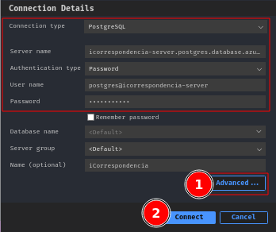

Na seção avançada, altere o **SSL mode** para **Require** depois clique em **OK** e na tela subsequente em **Connect**.

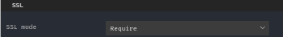

Depois de criada a conexão, vamos abrir um nova consulta para poder criar a base de dados.

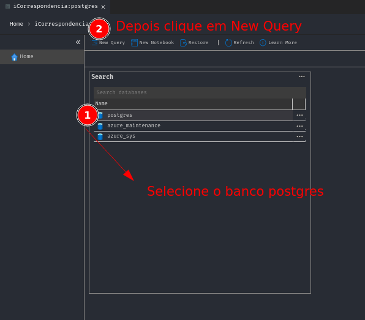

Execute o comando a seguir conforme a imagem:

```sql
CREATE DATABASE icorrespondencia;

CREATE USER fiap WITH PASSWORD 'Fiap@2021';

GRANT ALL PRIVILEGES ON DATABASE "icorrespondencia" TO fiap;
```

:warning: é esperado a criação de uma nova base de dados, além de um novo usuário para essa base, que serão utilizados posteriormente no deploy da aplicação.

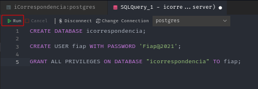

Em caso de sucesso, será apresentada a mensagem no log, conforme imagem abaixo:

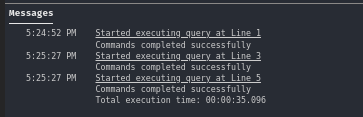

Feito isso, podemos fechar o **Azure Data Studio**.

### Jenkins

#### Ferramentas Globais

Na tela principal do Jenkins, acesse o menu lateral à esquerda a opção **Manage Jenkins**, em seguida **Global Tool Configuration**. Na tela a seguir, desça até encontrar Maven. Clique em **Maven installations** e aponte para o caminho da instalação do Maven na mesma máquina onde se encontra instalado o Jenkins em seguida clique em **Save**.

:warning: Tenha certeza de manter a mesma nomenclatura no **Name** para **apache-maven**, caso contrário, o pipeline pode ocasionar em erros.

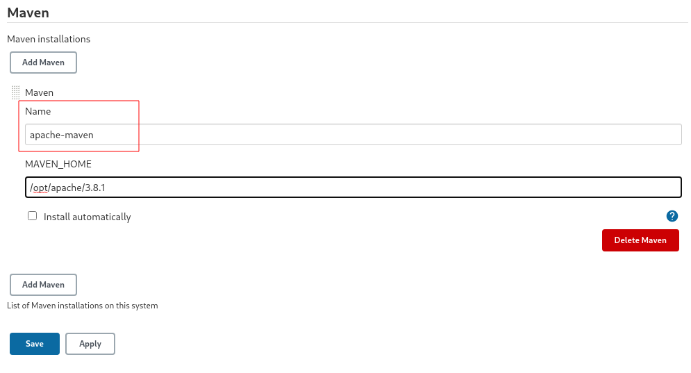

Retorne à tela principal e crie o Pipeline conforme demonstrado em **vídeo**.

:warning: Conforme explicado em vídeo, existe um bug na sintaxe **Declarative** do Jenkins, portanto, o primeiro job será utilizado apenas para atualizar as configurações, devendo ser cancelado assim que iniciar. Ao atualizar a página, as parametrizações já serão aplicadas.

### Extra

Após realizar todos os testes, é recomendado excluir todos os recursos criados, inclusive as configurações realizadas nessa documentação.

Para exclusão dos recursos do Azure:

-   Deletar o grupo de recursos e tudo contido nele:
    ```sh
    az group delete --name rg-21things-challenge
    ```
-   Deletar o serviço de autenticação do Azure Active Directory:
    ```sh
    az ad sp delete --id <appId>
    ```
